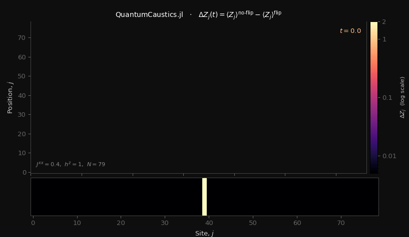

# QuantumCaustics.jl


*Left: a caustic cast by a glass of water. Right: the same focusing reproduced in a quantum spin chain, the light cone of magnetisation after a single spin flip at the centre, position against time. This package produces the right-hand panel.*

<div align="center">
  
</div>

*Colour scale: magma, log scale, ΔZ ∈ [0, 2]. The central spin is flipped at
t = 0 and the caustic fringes propagate outward at the Lieb-Robinson velocity
v = 2J^xx, obeying the 2/3 power law of an Airy fold throughout the
paramagnetic phase.*


## Introduction               

Better batteries, new materials, and new medicines depend on how large but finite groups of quantum particles behave together, the subject of many-body quantum dynamics, and that behaviour is hard to compute. Describing N particles exactly takes 2^N numbers, so evolving them means multiplying matrices of that size: for 20 particles, about a million by a million, near 18 terabytes, beyond most computers. Each added particle doubles the dimension, so the cost grows exponentially.

Useful quantum applications involve hundreds or thousands of particles, far more than an exact calculation can hold. One question at that scale is how an error or a perturbation spreads through the dynamics, and bounding that spread in advance shows whether a simulation will hold to tolerance before expensive hardware time is spent on it, instead of running it blind and repeating it.

There are two ways forward. A quantum computer would reproduce the system directly, but present-day machines are small and error-prone, and for now their noise dominates the result. The other route is to run "simulations" on ordinary computers. Many important problems and quantum states of interest are far less entangled than the worst case, which would require the complete information about a quantum system to get a meaningful result. Leveraging this, a tensor network keeps only the most relevant quantum information, the part that carries the entanglement, and drops the rest at each step. We use this idea, the density matrix renormalisation group (DMRG) for ground states and time-evolving block decimation (TEBD) for time evolution on a tensor network, to simulate the dynamics of hundreds of interacting quantum spins on a classical computer.

This package applies TEBD to the question: when a quantum chain is disturbed at a single site, how does the disturbance spread? For example, if a spin is flipped from an otherwise ordered ground state, we track how the change spreads outward as a wave. At its front the signal concentrates into a sharp, repeating pattern, a "caustic", the same focusing of light that creates the bright patterns on the floor of a sunlit swimming pool, or the cusp of light inside the glass of water above. Catastrophe theory describes these patterns, and the spacing of the fringes shrinks with distance by a fixed power. A change in this power law also marks a phase transition, the point where the ordered phase transitions to the disordered one. In the quantum version the same pattern can also become a diagnostic. That is, studying how the spacing of its fringes scales with distance marks where the chain crosses between order and disorder.

This package evolves the chain, measures the magnetisation and the entanglement at every site and step, and produces the colour map in which the caustic appears. The magnetisation it records is the input any scaling analysis reads. Every run can be checked against a full exact calculation on small chains, so no result rests on a single method.

On a laptop the exact engine runs out of memory near 28 spins, too few for the scaling, while the tensor network reaches several hundred; the colour map above is a 301-site run. The package produced the calculations in Singh Roy et al. (Physical Review A, 2026; arXiv:2410.06803), regenerable from a clean checkout. A coauthor reproduced them independently in Python, the cross-check cited there. It is also a base for further work on how quantum systems evolve and how measurement alters them.

## The model and its phases

The chain is the transverse-field Ising model, Eq. 1 of the paper,

H = - Jxx sum_j X_j X_{j+1} - hz sum_j Z_j,

with an optional integrability-breaking coupling that adds - Jzz sum_j Z_j Z_{j+1} (Eq. 23 in the paper). Jxx is the spin-spin coupling, hz the transverse field, and Jzz is zero in the pure model and small when the scaling is tested against integrability breaking. The transition occurs at Jxx = hz. Thus, the ratio Jxx/hz determines the phase: below it the chain is paramagnetic, the disordered phase in which the field dominates, and above it the chain is ferromagnetic, the ordered phase in which the coupling dominates. The phase can also be read off from the caustic pattern.

After the central spin flip, a checkerboard-like pattern travels from the point of the perturbation outwards in spacetime, bound by the Lieb-Robinson limit, and the spacing of the first two fringes scales as a power of distance. It is known that for the simplest catastrophe, the exponent is 2/3 throughout the paramagnetic phase, the universal value of an Airy fold. The exponent deviates from 2/3 once Jxx/hz approaches 1, the phase transition point. The caustic pattern and the 2/3 scaling also survive a weak integrability-breaking perturbation Jzz, but the caustic is lost as Jzz grows. The four regimes, the two phases and weak and strong integrability breaking, are the committed problem instances in problems/, described under "Problem instances" below.

## Install

You need Julia 1.10 or later. If you do not have it, install it from the Julia website (julialang.org).

Clone the repository and install everything it needs:

```bash
git clone https://github.com/monalisasroy/QuantumCaustics.jl.git
cd QuantumCaustics.jl
julia --project=. -e 'using Pkg; Pkg.instantiate()'
```

The dependencies and their resolved versions are recorded in Project.toml and the committed Manifest.toml, so this one command installs them all, with nothing added by hand. To confirm the install, run the tests:

```bash
julia --project=. -e 'using Pkg; Pkg.test()'
```

## Run it

The quickest reproducible run is a named problem instance. This evolves the paramagnetic chain of the paper at its full size and writes the two observables into results/, with their figures in results/figures/:

```bash
julia --project=. run.jl --problem tfim_paramagnetic
```

For a faster first look, a small chain set by flags finishes in a few minutes on a laptop:

```bash
julia --project=. run.jl --N 21 --Jxx 0.5 --hz 1.0 --T 30 --output-dir results/
```

Either way, open the dZ_*.png it writes to results/figures/: the light cone and its fringe pattern after a single spin flip at the centre. The matching Z_*.png is the raw magnetisation, where the boundary's reversed cone is visible.

## Problem instances

The regimes of the paper are committed as named parameter files in problems/, so a result is reproduced by name rather than by retyping flags. Each is read like a parameter file and run with one command:

```bash
julia --project=. run.jl --problem tfim_paramagnetic        # one instance
julia --project=. run.jl --problem all                      # every instance
```

Each instance writes two observables into results/ as a .txt, with a matching .png in results/figures/: the raw magnetisation Z_<tag>, the measured light cone in which the boundary's reversed cone is visible, and the subtracted caustic dZ_<tag>, in which the boundary cancels and the 2/3 scaling lives. The instances are:

| instance | parameters | what it shows |
|---|---|---|
| tfim_paramagnetic | Jxx 0.5, hz 1.0 | the universal 2/3 caustic (Figs 2, 3a) |
| tfim_ferromagnetic | Jxx 1.5, hz 1.0 | the exponent departs from 2/3 (Fig 4a) |
| tfim_paramagnetic_jzz_weak | Jxx 0.5, hz 1.0, Jzz 0.2 | the caustic survives weak breaking (Fig 4b) |
| tfim_paramagnetic_jzz_strong | Jxx 0.5, hz 1.0, Jzz 0.4 | the caustic degrades |

The naming is tfim_<phase>, with an optional _jzz_<strength>; a new instance is one small file in problems/. These run at the paper's size, N = 79, so they take longer than the small run above.

## Setting parameters

Parameters come from one of three places:

- src/parameters.jl holds the default for every parameter, each a named constant in one file. Edit a constant there to change the default for every run.
- Command-line flags override those defaults for a single run or sweep.
- A problem instance in problems/ sets them from a named file, the reproducible way, run with --problem NAME.

Whichever is used, each run logs the parameters it resolved, with the centre site, the step count, and the phase, as a double-check before it computes.

## Worked example

Used from a REPL, the package is the interactive path the Julia workflow recommends: import it once, then call it, which pays the compilation latency a single time rather than on every script start.

```julia
using QuantumCaustics
spec = TransverseFieldIsing(; Jxx = 0.5, hz = 1.0, boundary = OPEN)
res  = caustic_difference(spec; N = 21, dt = 0.1, ttotal = 30.0)
write_caustic(res, "results")   # data .txt in results/, figures .png in results/figures/

# validate the same setup against the exact engine at small N
cmp = compare_caustic(spec; N = 9, dt = 0.1, ttotal = 10.0)
@show cmp.dZmax cmp.dZmean cmp.dSmax
```

On a laptop this produces a 21-site run in a few minutes, a small version of figure 2. The result carries the raw magnetisation and the half-chain entanglement at every site and step, the observables any scaling analysis reads.

## What this computes

- The raw magnetisation <Z_j(t)> after the central quench, the measured light cone, and its no-flip subtraction dZ of Eq. 22, where the caustic appears with the boundary cancelled.
- The half-chain entanglement entropy that the convergence study in Appendix A reports.
- Validation of the evolution against the exact engine at small N, in both the magnetisation and the entanglement, run by the test suite.

The two observables, the raw magnetisation and dZ, are the inputs any downstream analysis reads. The order parameter O12, the normalised delay between the first two peaks at a fixed site, and the power-law fit of its exponent against distance follow from the dZ data a run writes; this version produces the evolution, the measurements, and the caustic, and leaves the fit to the reader.

## Method

A structured walk-through of the method, the conventions, and the convergence controls is in docs/implementation_plan.md, written for a reader meeting matrix product states for the first time.

## Command line and sweeps

Beyond the named instances, every parameter flag takes one or more values, and the run repeats for each combination, so a sweep is one command. Each run writes both observables as data in the output directory, with matching figures in its figures/ subdirectory, "Z_<tag>" and "dZ_<tag>".

```bash
# one run
julia --project=. run.jl --N 79 --Jxx 0.5 --hz 1.0 --T 40 --maxdim 256 --output-dir results/

# sweep Jxx across the transition, one run per value, into one directory
julia --project=. run.jl --N 79 --Jxx 0.4 0.6 0.8 1.0 1.2 --hz 1.0 --output-dir results/sweep
```

A long sweep can be detached and stopped from the shell:

```bash
nohup julia --project=. run.jl --N 79 --Jxx 0.4 0.6 0.8 1.0 1.2 1.4 --hz 1.0 \
  --T 100 --output-dir results/sweep > sweep.log 2>&1 & echo $! > sweep.pid
tail -f sweep.log
kill "$(cat sweep.pid)" 2>/dev/null
```

## Validating against the exact engine

The exact engine is part of the package, and the test suite runs it on every change. At small N it evolves the same chain on a full statevector under the brickwall the MPS applies, with no truncation, and checks the MPS against it, which pins the operator factor and the Hamiltonian sign. The statevector holds 2^N amplitudes, so this engine reaches about 28 spins, where the MPS reaches several hundred. A dense propagator supplies the true dynamics exp(-i H dt) at small N, the reference that separates the Trotter error from the MPS truncation. Against the statevector brickwall the MPS agrees to truncation, which at small N is none; against the true dynamics it converges as dt decreases. The same checks are available from the REPL.

```julia
spec = TransverseFieldIsing(; Jxx = 0.5, hz = 1.0)
cmp  = compare_caustic(spec; N = 9, dt = 0.05, ttotal = 8.0)
cmp.dZmax   # difference from the exact statevector brickwall, truncation only
cmp.dSmax   # the same, in the half-chain entanglement
prop = exact_propagator(spec; N = 9, dt = 0.05, ttotal = 8.0)   # true dynamics exp(-iHdt)
```

## Layout

```
QuantumCaustics/
  Project.toml            one manifest; dependencies resolved on install
  run.jl                  CLI entry point over the library
  README.md  NOTES.md     usage; method, conventions, and results
  LICENSE  CITATION.cff   Apache 2.0 licence; software and paper citation
  docs/                   implementation_plan.md; caustics_animation.gif, caustics_spacetime.png (landing-page figures)
  references.bib          one citation-key convention
  src/                    core functions and utilities
  test/                   runtests.jl, including the exact-engine cross-checks
  notebooks/              caustics_tfim.ipynb, an example notebook illustrating the package
  problems/               tfim_*.toml, the paper's regimes as parameter instances
  results/                runtime outputs (data here, figures in results/figures/), outside the source tree
```

## Citation

This package is the implementation behind the calculations in Singh Roy et al., "Universal scaling of quantum caustics in the dynamics of interacting particles" (Physical Review A, 2026). The results were independently reproduced in Python by a coauthor as part of their project; that reproduction is cited in the current manuscript and is an independent cross-check. Cite the software through CITATION.cff and the paper through the entry in references.bib.

The package is also the base for the author's continuing work on quantum dynamics and measurement-induced transitions in these systems.

## Status and caveats

The package provides the evolution, the measurements, the two observables (the raw magnetisation and the subtracted caustic dZ), and the exact-engine cross-checks (the statevector brickwall and the dense propagator). The power-law fit that turns the caustic into the scaling exponent is left to downstream analysis; the dZ and the time axis a run writes are its input, and anyone with them can run the fit. In the paper the fitted exponent converges near 0.68, close to the theoretical 2/3, and a fully universal finite-size scaling was not reached; NOTES.md records this, and why the inhomogeneous single-flip geometry does not map onto an infinite, translationally invariant MPS. Open boundaries are the setting of the paper's numerics, where the dZ subtraction cancels the boundary.

## License

Apache 2.0. Copyright 2026 Monalisa Singh Roy. See LICENSE. The software citation is in CITATION.cff and the paper in references.bib.
